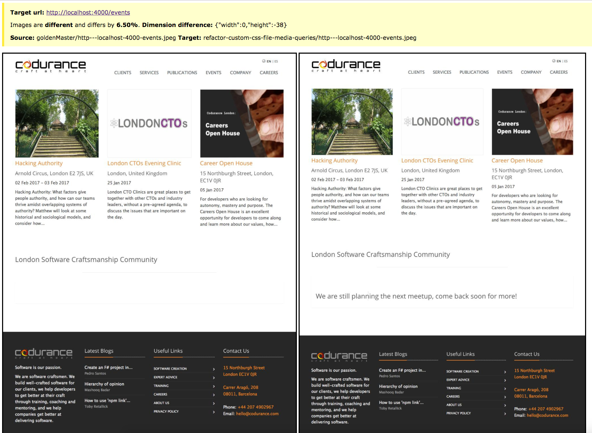

site-diff-tool
==============

A simple tool put together with the help of bash scripts and some JS libraries to help compare two versions of the website [site](https://github.com/codurance/site) and tell us if there is a difference in the visual layout.

The bash scripts and JS scripts do the following:

    - gathers URLs (after applying filters, creates separate lists for EN and ES sites)
    - captures screen shots via the URLs (ignores already existing images)
    - compares two screenshots and reports differences (in percent) between them

Installation
------------
Ensure `npm` (~ v3.8.9) and `node` (~ v6.2.0) are available on the target machine where this will be run.

Clone this repo and ensure the `site` project is available and can be run using `jekyll` (see instructions in the `site` project).

Run `npm install --save-dev` to ensure all node dependencies are in place, it's personal preference to install the dependencies globally using `npm install -g`.

Install `GNU Parallel`, see https://www.gnu.org/software/parallel/.

Usage
-----

#### Create a golden master of `site`

- Clone `site`
- Checkout the `master` branch
- Ensure `site` is running, after executing the script `.\buildAndRunSite.sh` provided with the `site` project
- Wait for `site` to start up and become ready to serve pages
- Change to the `site-diff-tool` project
- Run `./get-urls-from-site.sh` (this will create two .txt files)
- Run `./take-screenshot-of-whole-site.sh` (output will be image files and will be created in the `golden master` folder)

#### Create a snapshot of changes made to `site`
- Stop server running `site`   
- Remove the `_site` folder from inside the `site` project - to avoid residual from master branch (`rm -fr _site`)
- Checkout the branch that contains the changes you wish to compare using the `goldenMaster`
- Ensure the site is running again, by executing the script `.\buildAndRunSite.sh`
- Wait for `site` to start up and become ready to serve pages again
- From inside the `site-diff-tool` project , run `./take-screenshot-of-whole-site.sh [unique name for the output folder]` (output will be created in this unique folder)
- Then finally, run `./compareSites.sh goldenMaster [unique name for the output folder] >> comparisonResults-[unique text].log`

The results of the comparisons are stored in the `comparisonResults-[unique text].log` file. They look like the below when the web pages are different, no response is printed if they are the same (to avoid noise in the logs):

```html
.
.
.

<div>
    <div>
      <div class='panel note'><p><strong>Target url:</strong> <a href='http://localhost:4000/2015/03/16/installing-zprezto-a-quick-guide'/>http://localhost:4000/2015/03/16/installing-zprezto-a-quick-guide</a></p>
      <p>Images are <strong>different</strong> and differs by <strong>10.67%</strong>. <strong>Dimension difference:</strong> {"width":0,"height":78}</p>
      <p><strong>Source:</strong> goldenMaster/http---localhost-4000-2015-03-16-installing-zprezto-a-quick-guide.jpeg <strong>Target:</strong> refactor-custom-css-file-media-queries/http---localhost-4000-2015-03-16-installing-zprezto-a-quick-guide.jpeg </p>
    </div>
    <div class='container'>
      
      
    </div>
  </div>
  <br>
  <hr>
.
.
.
```

Differences are denoted in percentage and also dimensions are printed.

#### Final comparisons
To find out what the differences are between the `golden master` and the snapshot of the changes made to `site`, insert the contents of the output produced by the above script `compareSites.sh` into the body of `CompareImages.html`, look for the comment in the file: `<!-- Paste your body with <div>s here -->`, save the file.

The open the `CompareImages.html` in the browser to something like the below example:




#### Other usages of the scripts

##### Generate a screen-shot of a single URL

Run `./take-a-screenshot-of-a-page.sh http://localhost:4000/2014/07/27/tell-dont-ask somefolder/http---localhost-4000-2014-07-27-tell-dont-ask.jpeg`


##### Compare two screen-shots

Run `./compareSourceAndTarget.sh goldenMaster/somePage.jpeg anotherBranch/someOtherPage.jpeg`


##### Difference in layouts

Below is an example of the differences between layouts that would be detected by the `site-diff-tool`:

